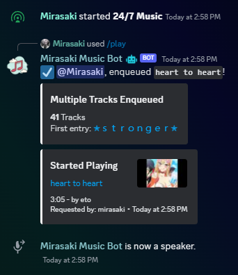
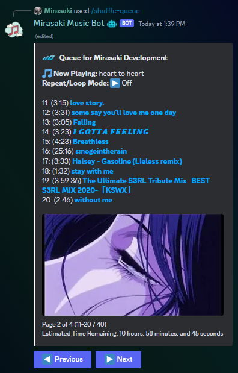
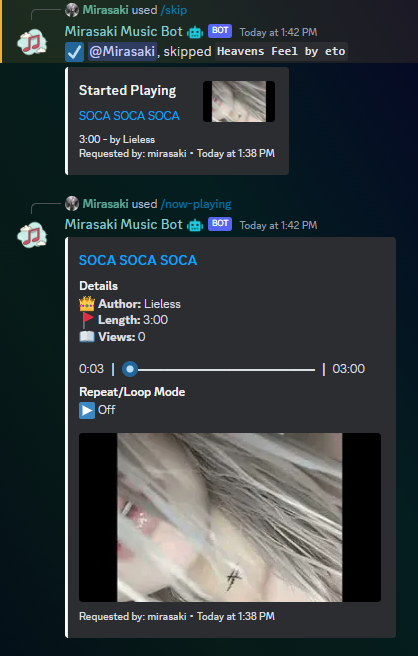
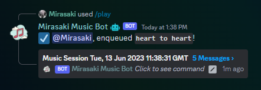
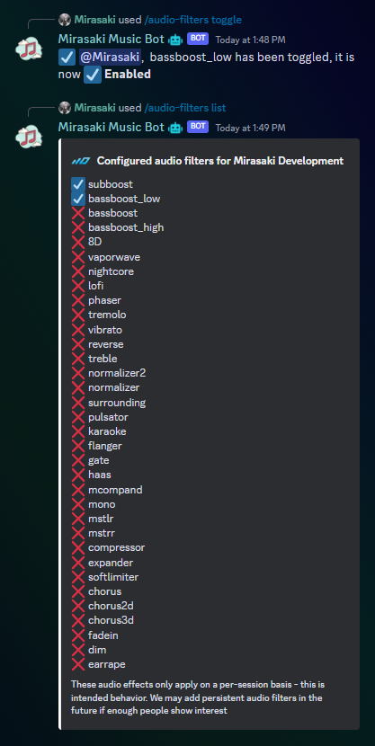
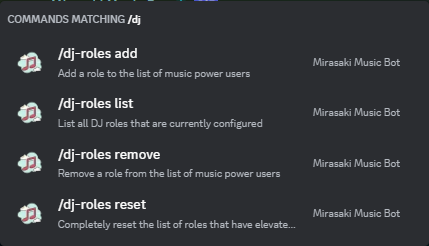
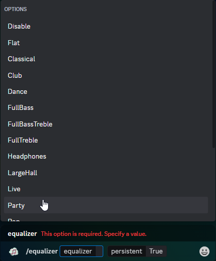
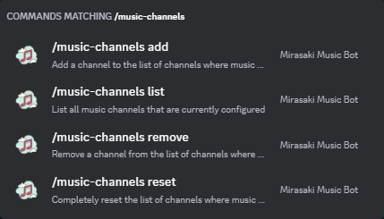
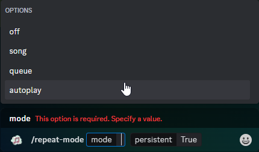
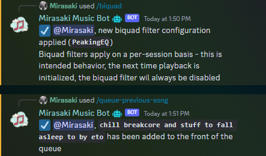

<p align="center"></p>
<h1 align="center">Mirasaki Music Bot</h1>
<div align='center'>

[](https://github.com/semantic-release/semantic-release)

[](https://www.codefactor.io/repository/github/mirasaki/mirasaki-music-bot)
[](https://opensource.org/licenses/MIT)


</div>
<p align="center">
  A free, open-source JavaScript music bot created with <a href="https://discord.js.org/#/"><code>discord.js</code></a> and <a href="https://discord-player.js.org/"><code>discord-player</code></a>. Complete (45+ commands) with persistent settings, effects, filters, auto-play, DJ-roles, and so much more.
</p>

<p align="center">
  <a href="https://youtube.com">YouTube</a>
  •
  <a href="https://spotify.com">Spotify</a>
  •
  <a href="https://soundcloud.com/">SoundCloud</a>
  •
  <a href="https://music.apple.com/">Apple Music</a>
  •
  <a href="https://vimeo.com/">Vimeo</a>
  •
  <a href="https://www.reverbnation.com/">ReverbNation</a>
  •
  <a href="https://discord.com">Discord Attachments</a>
</p>

<br />
<p align="center"><a href="/assets/showcase/thumbnail.gif"></a>

<br />
<br />
<h2 align="center">⭐ It's free, open-source, and self-host - meaning you're in full control</h2>
<p align="center">
  This project was created and open-sourced by <a href="https://mirasaki.dev" target="_blank">Mirasaki Development</a>. That means it's publicly available for anyone to grab and use in any way you want (MIT licensed). This project will never be monetized, every feature will always be free. All we need to keep adding new functionality and modules is some GitHub stars. Join the absolute <strong>legends</strong> below by clicking that Star button in the top-right of your screen, it doesn't cost you anything <strong>and</strong> means the world to us ❤️
</p>
<br />

<div align='center'>

[](https://github.com/Mirasaki/mirasaki-music-bot/stargazers)
</div>
<br />
<br/>

## 📜 Table of Contents

- [Showcase](#showcase)
- [Features](#features)
- [Demo](#demo)
- [Installation & Usage](#installation-and-usage)
  - [Prerequisites](#prerequisites)
  - [Docker](#run-as-a-docker-container-preferred)
  - [Node](#run-as-a-plain-nodejs-app)
- [Configuration](#configuration)
- [Discord Permissions](#discord-permissions)
- [Client Permissions](#client-permissions)
- [Support](#support)

<br/>
<h2 id="showcase">🎥 Showcase</h2>

<details>
<summary>Click to view</summary>















</details>

<br/>
<h2 id="features">🤩 Features (non-exhaustive, always adding more)</h2>

- Easy installation
- Settings with persistency
- 60+ total audio filters
- Multiple server support
- Vote skip
- Search, play, and lyrics autocomplete enabled
- Search play buttons
- DJ Roles
- Dedicated music channels
- Thread sessions
- Auto-play (24/7)
- Biquad filter + Equalizer
- 4 Repeat/loop modes
- Full track history
- Slash commands and modern Discord components
- Lyrics
- Volume (persistent)
- Full playback control
  - with over 20 player-control commands like
  - `/pause`
  - `/skip-to`
  - `/swap-songs`
  - and so much more
- Save songs by sending it to your DMs

<br/>
<h2 id="demo">🎁 Demo</h2>

Don't take our word for it, though. Instead, you should just see for yourself in our [support server](https://discord.gg/mirasaki).

<br/>
<h2 id="installation-and-usage">🔨 Installation & Usage</h2>

### Prerequisites

- [FFmpeg](https://ffmpeg.org/) or Avconv
  - Windows: [download source](https://ffmpeg.org/download.html#build-windows)
  - Linux: [packages](https://ffmpeg.org/download.html#build-linux)
  - macOS: [static builds](https://ffmpeg.org/download.html#build-mac)
  - Directly supported through Docker
  - If you're having trouble installing FFmpeg, you can try [ffmpeg-static](https://www.npmjs.com/package/ffmpeg-static), by running `npm install ffmpeg-static` - this is a last resort and **not** recommended
- A [Discord Bot account](https://discord.com/developers/applications "Discord Developer Portal")
    1) Head over to the page linked above
    2) Click "New Application" in the top right
    3) Give it a cool name and click "Create"
    4) Click "Bot" in the left hand panel
    5) Click "Add Bot" -> "Yes, do it!"
    6) Click "Reset Token" and copy it to your clipboard, you will need it later
- [NodeJS](https://nodejs.org/en/download/ "Node official website") (if you're running as a plain NodeJS app)
    1) Head over to the download page
    2) Download the latest LTS build available for your OS
    3) Be sure to check the box that says "Automatically install the necessary tools" when you're running the installation wizard

### Run as a Docker container (preferred)

The quickest and easiest way to host/use this bot is by deploying it inside of a [Docker](https://docs.docker.com/engine/install/ "Official Docker Website") container.

> *A [**docker compose**](https://docs.docker.com/compose/ "View docker compose documentation") file is included for your convenience*

1. Clone this repository: `git clone https://github.com/Mirasaki/mirasaki-music-bot.git`
2. Navigate inside the new folder: `cd mirasaki-music-bot`
3. Rename `/.env.example` to `.env` and provide your environmental variables
    - Windows users often experience issues with this file, if you're getting errors that the env file can't be found, or `Expected path argument to be of type string` - check out [this timestamped video](https://youtu.be/6rOCUZ8opLM?t=42)
4. (optional) Rename `/config.example.js` to `config.js` and provide your bot configuration
5. Build the project: `docker build --tag my-mirasaki-music-bot .`
6. Start the bot: `docker run -it --env-file .env --name my-mirasaki-music-bot`

### Run as a plain NodeJS app

You can also clone this repository or download a release, and host the project directly. You will need [Node/NodeJS](https://nodejs.org/en/ "Node official website") (Be sure to check the box that says "Automatically install the necessary tools" when you're running the installation wizard)

1. Head over to [the download page](https://github.com/Mirasaki/mirasaki-music-bot/releases/)
    - Alternatively, clone this repository by using `git clone https://github.com/Mirasaki/mirasaki-music-bot.git` and skip to step 4 if you have [Git](https://git-scm.com/downloads "Git Download Section") installed
2. Download either the `zip` or `zip.gz` source code
3. Extract it using [your favorite zip tool](https://www.rarlab.com/download.htm "It's WinRar, duh")
4. Open a new console/terminal/shell window in the newly created project folder
5. Run `npm install` to install all dependencies
6. Rename [`/.env.example`](/.env.example "View .env.example file in current repository") to `.env` and configure your environmental variables
    - Windows users often experience issues with this file, if you're getting errors that the env file can't be found, or `Expected path argument to be of type string` - check out [this timestamped video](https://youtu.be/6rOCUZ8opLM?t=42)
7. (optional) Rename [`/config.example.js`](/config.example.js "View config.example.js file in current repository") to `config.js` and go through your bot configuration
8. Use the command `node .` to start the application, or alternatively:
    - `npm run pm2:start` to keep the process alive in the background with [PM2](https://pm2.io/ "PM2 | Official Website"), suitable for production environments. (`npm i -g pm2` to install)
    - `npm run start:dev` if you have `nodemon` installed for automatic restarts on changes, suitable for development environments

<br/>
<h2 id="configuration">🛠️ Configuration (optional - alternatively configurable with commands)</h2>

All configuration is done in `/config.js`. Multiple Discord servers are supported. The configuration file is created during the installation and usage steps. Below is detailed information on what the settings do.

```js
{
  // Note: all the default# properties all configurable by commands
  // This is here so that you can configure everything in one go
  // without having to figure out different commands,
  // if you're not comfortable editing this, use the commands

  // Note: default# properties only take affect the first time
  // playback is initialized in your server/guild

  // Between 0 and 100
  // 100 is obnoxiously loud and will f*** your ears
  defaultVolume: 5,

  // The default repeat mode
  // 0 - Off | Don't repeat
  // 1 - Track | Repeat current track, always - until skipped
  // 2 - Queue | Repeat the entire queue, finished songs get added back at the end of the current queue
  // 3 - Autoplay | Autoplay recommended music when queue is empty
  //
  // 3 = 24/7 autoplay/continuous radio if uninterrupted - only use if you have
  // bandwidth for days
  defaultRepeatMode: 0,

  // Amount of seconds to stay in the voice channel
  // when playback is finished
  // Default: 2 minutes
  defaultLeaveOnEndCooldown: 120,

  // Should the bot leave the voice-channel if there's no other members
  defaultLeaveOnEmpty: true,

  // Time amount of seconds to stay in the voice channel
  // when channel is empty/no other members aside from bot
  // Only active when leaveOnEmpty is true
  // Default: 2 minutes
  defaultLeaveOnEmptyCooldown: 120,

  // When true, will create a thread when the voice session is first initialized
  // and continue to send music/queue events in that thread instead of flooding
  // the channel
  defaultUseThreadSessions: true,

  // When true, and defaultUseThreadSessions is true, will only allow commands involving
  // the current session to be used in the created session Thread channel
  defaultThreadSessionStrictCommandChannel: true,

  // Plugins/Music source extractors
  plugins: {
    fileAttachments: true,
    youtube: true,
    soundCloud: true,
    appleMusic: true,
    vimeo: true,
    reverbNation: true,
    // To disable Spotify:
    // spotify: false,
    spotify: {
      clientId: process.env.SPOTIFY_CLIENT_ID,
      clientSecret: process.env.SPOTIFY_CLIENT_SECRET
    },
  },

  // Bot activity
  presence: {
    // One of online, idle, invisible, dnd
    status: 'online',
    activities: [
      {
        name: '/play',
        // One of Playing, Streaming, Listening, Watching
        type: 'Listening'
      }
    ]
  },

  // Permission config
  permissions: {
    // Bot Owner, highest permission level (5)
    ownerId: '290182686365188096',

    // Bot developers, second to highest permission level (4)
    developers: [ '' ]
  },

  // The Discord server invite to your Support server
  supportServerInviteLink: 'https://discord.gg/mirasaki',

  // Additional permissions that are considered required when generating
  // the bot invite link with /invite
  permissionsBase: [
    PermissionsBitField.Flags.ViewChannel,
    PermissionsBitField.Flags.SendMessages,
    PermissionsBitField.Flags.SendMessagesInThreads
  ]
}
```

<br/>
<h2 id="discord-permissions">🟣 Discord Permissions</h2>

> This is not the permission level required to execute actions or run commands, like User, Moderator or Administrator

Invite the bot to your server by navigating to the following URL (replace `YOUR_CLIENT_ID` with `DISCORD_CLIENT_ID` from the `/.env` file):

`https://discord.com/api/oauth2/authorize?client_id=YOUR_CLIENT_ID&permissions=0&scope=bot%20applications.commands`

Any command can be used without any Discord permissions, as long as the bot is invited to your server with the `bot` and `applications.commands` scopes. You can use the template url above, or alternatively, generate an invite link in the [Discord Developer Portal](https://discord.com/developers/applications) (Your App > OAuth2 > URL Generator > `scopes: bot + applications.commands`)

For the bot to be able to join your Voice Channel, it will need the `View Channel`, `Connect` and `Speak` permissions.

The bot needs the `View Channel`, `Send Messages`, and `Embed Links` in any channel where playback is initialized to be able to send event notifications to that channel.

<br/>
<h2 id="client-permissions">🟢 Client Permissions</h2>

These are permission levels that are used internally by the bot to determine the permission level of any given user and determine which commands they can use. Available permissions levels are:

> *You can modify Moderators, Administrators, Developers and Bot Owners in `/config.js`, this is optional*

- 0 - User - This is the default permission levels, everyone has this this - doesn't have access to any dangerous commands
- 1 - Moderator - Unused in this bot. Anyone that has the Discord permissions `Kick Members` and `Ban Members` is considered a Moderator
- 2 - Administrator - The Administrator permission level is the highest permission level that can be assigned through Discord. Anyone with the Discord permission `Administrator` is considered an Administrator internally and will have access to powerful commands like `/clear-queue`
- 3 - Server Owner - This is the permission level of your Discord server owner, only 1 person can have this at any given time. Used to make sure server owners have a snowflake permission level internally 🙏 Doesn't currently have any exclusive commands, but you can choose to restrict commands to this permission level as needed
- 4 - Developer - This is for members that develop on the bot, has access to dev utilities like `/eval` and `/exec`. This permission level can do almost everything, including evaluating arbitrary code on your host machine - use with caution!
- 5 - Bot Owner - Bypasses every permission bit and level check, has access to every command and command.

You can modify required permission levels to execute commands in the command files by setting the permLevel property. Let's take a look at an example `/src/commands/` file:

```javascript
module.exports = new ChatInputCommand({
  // Inside of the ChatInputCommand({
  // Can be set to User, Moderator, Administrator, Server Owner, Developer, Bot Owner
  // Support IntelliSense/auto-complete
  permLevel: 'Administrator',
  // ... other properties
  run: async (client, interaction) => {
    // The commands #run/execute function
  }
});
```

<br />
<h2 id="support">Support</h2>

Join our [support server](https://discord.gg/mirasaki) if you need any further assistance, have feature suggestion or have any other feedback

[](https://discord.gg/mirasaki)

Contact me personally for legal enquiries at: `me@mirasaki.dev`

<br/>

> Open source, self-hosted, and MIT licensed, meaning you're in full control.

<br/>  
<p align="center"><a href="https://github.com/Mirasaki/mirasaki-music-bot#mirasaki-music-bot"></a></p>
